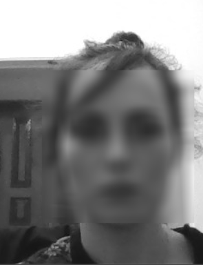
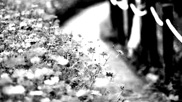
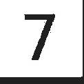
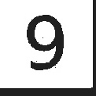

### Contrast

## 1- Adding Blur option 

## 2 - Increasing Contrast 25-5

https://user-images.githubusercontent.com/99975022/206917275-df551765-421f-47a6-a15b-f99f9db2c9bb.mp4

## 3- Increasing Contrast

## 4- Cropping-Mnist
 |  |  |
 |  |  | 
 |  | 
