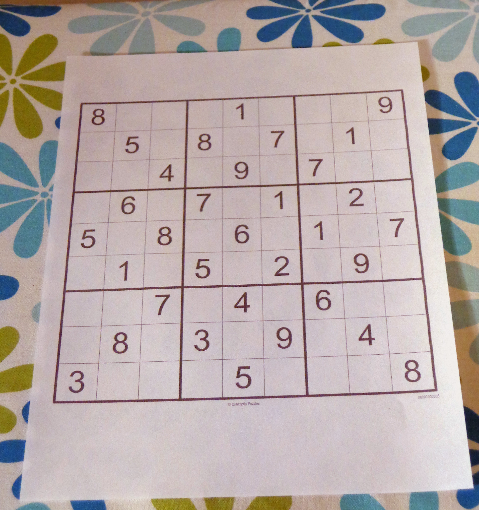

### Sudoku Detector

Detect and Crop Sudoku in python and Notebook files: 
* To run Notebook file you should read the code and put your own lines and addresses
* To run Python file you just need to run cmd and write the name of python file - name of Input image and the name of Output image.
  (The other parameters are not changeable in this way)

 | 
 | 
 |  | 

 
## Online Sudoku detector

