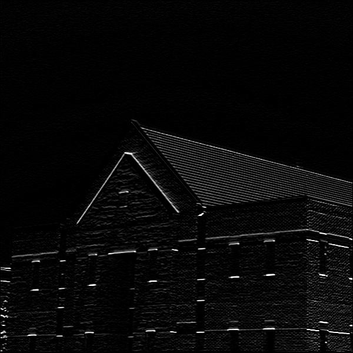

### Convolution 
## 1 - Blur

## 2- Edge Detection 

## 3- Edge Detection
* Vertical Edge Detection 

* Horizontal Edge Detection

## 4- Convolution different Filters
 

## 5- Color Detection

https://user-images.githubusercontent.com/99975022/205853619-a0ec0e1b-90fd-4ff5-af05-b19af5f5b30c.mp4

